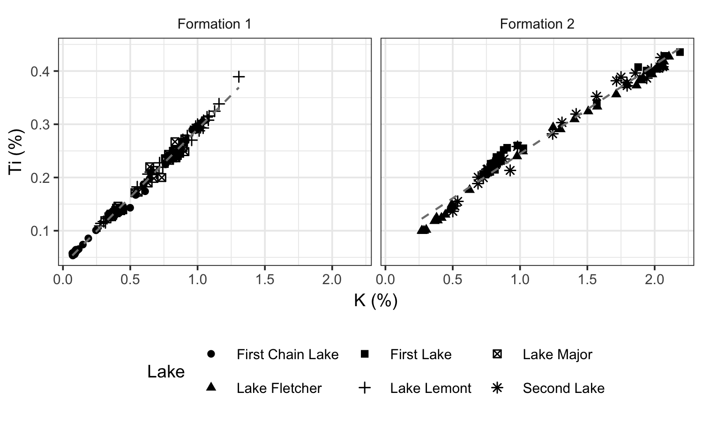

```{r setup, include=FALSE}
library(tidyverse)
theme_set(theme_bw(9) + theme(strip.background = element_blank()))
knitr::opts_chunk$set(echo = FALSE, dpi = 300, fig.path = "../figures/Dunnington_2_")
data <- read_csv(
  "http://paleolimbot.github.io/r4paleolim/data/halifax_geochem.csv",
  col_types = cols(.default = col_guess())
) %>%
  filter(!(core_id %in% c("BEN15-2", "POC15-2"))) %>%
  mutate(
    lake = fct_recode(
      core_id, 
      "Lake Major" = "MAJ15-1", 
      "First Chain Lake" = "FCL16-1",
      "Lake Lemont" = "LEM16-1",
      "Lake Fletcher" = "FLE16-1",
      "First Lake" = "FLK12-1",
      "Second Lake" = "SLK13-1"
    ),
    surface_formation = case_when(
      core_id %in% c("MAJ15-1", "FCL16-1", "LEM16-1") ~ "Formation 1",
      core_id %in% c("FLE16-1", "FLK12-1", "SLK13-1") ~ "Formation 2"
    )
  )
```

Leland Wilkinson's 2005 book _The Grammar of Graphics_ (GoG) is a must-read for any geoscientist who communicates data using graphics on a regular basis. Rather than thinking about graphics using pre-conceived templates (e.g., the "scatterplot", the "bar graph", or the "boxplot"), Wilkinson decomposes graphics into several orthogonal components: data, scales, statistics, geometries, and facets. In most implementations of the GoG, data consists of a table with one row for each object (e.g., a sediment sample), and one column for each variable (e.g., from which lake the sample was collected, or the concentration of an element in the sample) (Wickham 2014). One or more of these variables can then be mapped to a scale, which can represent a position on the plot (e.g., x-axis or y-axis) or an aesthetic (e.g., colour or shape). Before being passed to a geometry (e.g., a point, line, or polygon), the data can optionally be transformed using a statistic (e.g., a linear regression). Finally, data can be split into multiple panels using facets (e.g., one panel for each surficial unit). Using these elements, Wilkinson argues, almost any graphic can be constructed.

Creating a graphic using a template-based plotting library is like filling in a form, and creating a graphic using a GoG-based plotting library is like writing a paragraph on a blank page: writing a paragraph takes more work, but there is a limit to what one can communicate using a pre-conceived template. The flexibility of GoG-based plotting libraries is a similar trade off: creating any particular graphic may take more work, but there are few limits to the type of graphic one can create. If R is your language of choice, the `ggplot2` package provides what is perhaps the most widely used implementation of the GoG; in Python, the `plotnine` package implements the GoG using `matplotlib` as a plotting backend; and in JavaScript, the `G2` library implements the GoG using `D3.js`.

When graphics become more complex there are no pre-conceived templates, in which case it becomes much faster to use a GoG-based library. For example, the graphic shown below in most plotting libraries would require creating two separate plots with manually-scaled axes (to ensure they were the same as each other) and suppressed y-axis labels (on the second plot), drawing three series on each plot, and calculating/drawing two linear regressions. Finally, one would have to create a custom legend to incorporate the series for both plots. In a GoG-based framework, creating this plot requires specifying that the variable `K` should be mapped to the x-axis, the variable `Ti` should be mapped to the y-axis, the variable `Lake` should be mapped to the shape aesthetic, and that one panel should be drawn for each unique value in the `surface_formation` variable. Finally, one needs to specify that the first layer should be drawn using a point geometry (no transformation), and the second layer should be drawn using a line geometry (after calculating a linear regression).

Whether or not you use a GoG-based library, knowing the GoG makes it possible to decompose a graphic into its components and improve it, piece by piece. What makes effectively organized data? What makes an effective colour or shape scale? Could this graphic be more effective if the data were split into multiple panels? A quick read of _The Grammar of Graphics_, and you are likely to find the answer.



```{r ex-fig, fig.cap="Potassium (K) and titanium (Ti) concentrations from six lakes near Halifax, Nova Scotia, Canada, with catchments comprised of two primary surficial formations (Dunnington et al. 2018)", fig.height = 3, fig.width = 5, warning=FALSE}
ggplot(data, aes(x = K_percent, y = Ti_percent, shape = lake)) +
  geom_point() +
  stat_smooth(
    aes(group = surface_formation), 
    col = "grey50", lty = 2, size = 0.5,
    method = "lm", se = FALSE
  ) +
  facet_wrap(vars(surface_formation)) +
  theme(legend.position = "bottom") +
  labs(x = "K (%)", y = "Ti (%)", shape = "Lake")
```

## References

Dunnington, DW, IS Spooner, WH Krkošek, GA Gagnon, RJ Cornett, CE White, B Misiuk, and D Tymstra (2018). Anthropogenic activity in the Halifax region, Nova Scotia, Canada, as recorded by bulk geochemistry of lake sediments. _Lake and Reservoir Management_ **34**. [DOI: 10.1080/10402381.2018.1461715](https://doi.org/10.1080/10402381.2018.1461715)

Wickham, H (2014). Tidy Data. _Journal of Statistical Software_ **59**. [DOI: 10.18637/jss.v059.i10](https://doi.org/10.18637/jss.v059.i10)

Wilkinson, L (2005). *The Grammar of Graphics*. Springer-Verlag, New York. [DOI:10.1007/0-387-28695-0](https://doi.org/10.1007/0-387-28695-0)
