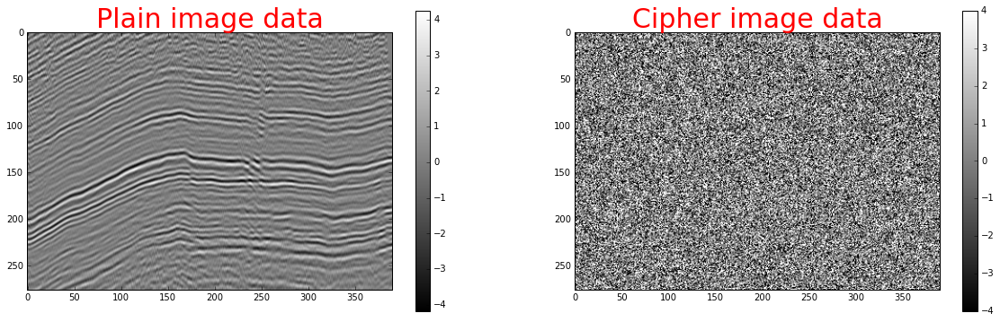
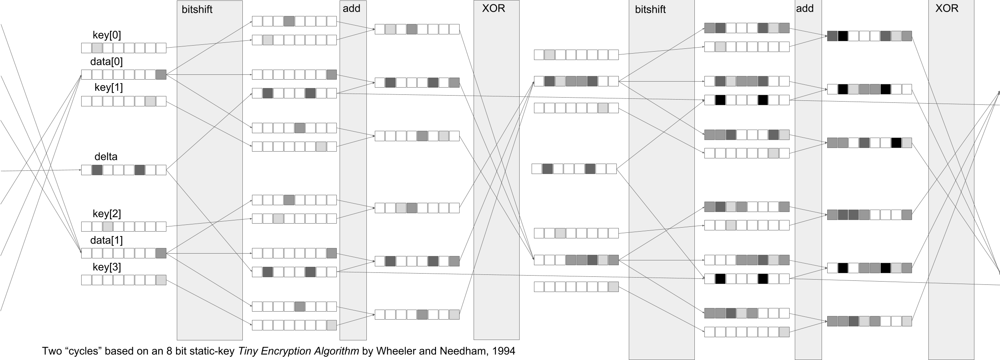

# Seismic Data Encryption

*By Graham Ganssle, 20170427.*

---

*Find all the code and the referenced free apps in this article’s GitHub repo: [https://github.com/gganssle/encryption-52things](https://github.com/gganssle/encryption-52things)*

---

###### A piece of Teapot Dome "Line A" and its encrypted counterpart. Plaindata obtained from [RMOTC and the U.S. Department of Energy](https://energy.gov/node/1012461/datasets.html) via the [SEG](http://wiki.seg.org/wiki/Teapot_dome_3D_survey).

## Why Encrypt Seismic Data?

If you transfer seismic data on unencrypted hard drives, (stop it, and) read this article. If your password is “password,” stop reading this article right now and go change it. Seismic data costs money and people’s dedication to acquire; its unauthorized transfer is illegal and, more importantly, a waste of these people’s efforts and time.

Not to mention money. A ton of money. By my calculations we only get about 4,800 bytes of seismic data for every dollar spent. The cost density of seismic data per byte isn’t quite up there with the Large-Hadron-Colliding, Higgs-Boson-finding cost density (2 bytes/dollar), but it’s still really high. It’d be pretty easy for the O’hare International baggage handlers to swap a bag containing forty million dollars worth of seismic (~200GB) onto the wrong flight. That’s a pretty tough story to tell your boss even if you weren’t wearing dirty socks. The story you should be telling instead is that you lost a fifty dollar hard drive that’s useless to anyone else because you encrypted the data.

## What is Seismic Data Encryption?

Pick your flavor: symmetric or asymmetric. Symmetric encryption goes like this: enter your password to encrypt some seismic data, enter the same password again to decrypt the seismic data. Asymmetric encryption is usually used during the transmission of seismic data when the recipient doesn’t have access to the sender’s password. Why wouldn’t the sender just tell the recipient the password?

###### *A pictorial representation of two cycles in an 8-bit version of a rotating-key Tiny Encryption Algorithm by Wheeler and Needham, a symmetric encryption workflow designed in the 1990s.*

The axiom, “someone is listening to your communication,” eliminates the possibility of sending a password to the data recipient. If there were a malicious third party attempting to steal your seismic data, that party would, by definition, also be capable of stealing the password to your encrypted seismic data file. So instead, during asymmetric encryption, the data is encrypted using a combination of two passwords, one of which the sender owns and one of which the recipient owns.

The summary is this: symmetrically encrypt seismic data on your external hard drive before you frolic around town with it. Asymmetrically encrypt seismic data before you email it to your friend in Bermuda. It’s free to do both of these things.

## How to Encrypt Seismic Data for Free

There are few commercial encryption tools which are acceptable for use. That’s because many commercial options aren’t open source. Open source allows testing by white hat attackers; those algorithms which repeatedly defy attacks bubble up the evolutionary encryption-software primordial soup, and are hailed “strong” encryption protocols.

I recommend (at the time of writing) the following free encryption software:

* To encrypt files symmetrically: AEScrypt ([https://www.aescrypt.com/](https://www.aescrypt.com/))
* To encrypt files asymmetrically: GnuPG ([https://www.gnupg.org/](https://www.gnupg.org/))
* To encrypt full disks on (gasp) Windows symmetrically: DiskCryptor ([https://diskcryptor.net/](https://www.diskcryptor.org/))
* To encrypt emails asymmetrically: OpenPGP via Enigmail ([https://www.enigmail.net/](https://www.enigmail.net/))

Use them. They’re free, and their encryption protocols are unbreakable by modern standards. Seismic data is expensive and difficult to acquire. Remember, if it isn’t yours to give, don’t give it away.

