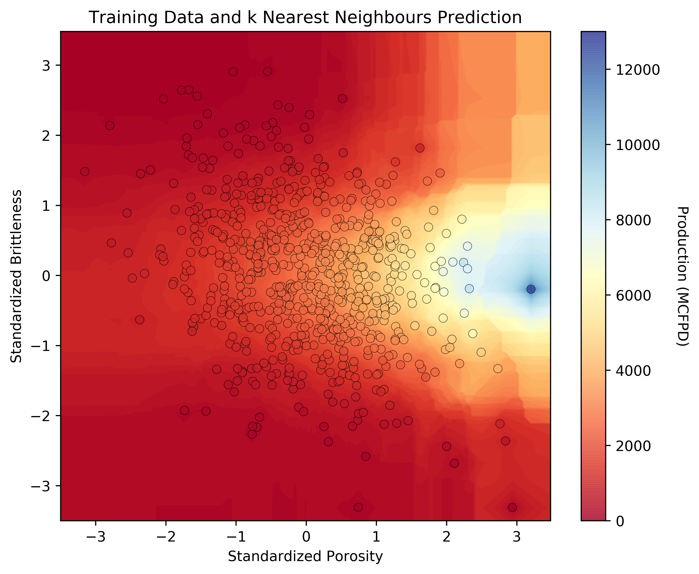

# Machine Learning for Geological Modeling

Michael J. Pyrcz  

There is an explosion of machine learning applications to aid with the interpretation of geological data sets and the construction of geological models, including novel methods for well log interpretation (Naeini et al., 2019), seismic interpretation (Di et al., 2019) and fluid flow forecasting (Nwachukwu et al., 2018). There are many good reasons to apply machine learning, as geological modeling includes, vast data sets that often cannot be visualized and interrogated practically and complicated systems that may preclude fully deterministic geoscience and engineering solutions. Machine assisted geological interpretation is not new, we can note with pride that geological characterization and modeling has been working with challenging big data settings long before the tech industry discovered big data (Lomask et al., 2006). While these data-driven machines are multiplying it is important to remain grounded, so here are some critical perspectives to help us be informed consumers of these technologies.

> Figure 1. example of k-nearest neighbour to predict pre-drill production rate from porosity and brittleness.

**The subsurface is unique** relative to other applications of machine learning. We deal with sparse data from highly heterogeneous spatial systems resulting in a high degree of uncertainty combined with a thick layer of essential interpretation and physics to fill in missing information and ensure consistency between data sources. In addition, subsurface development decisions are extremely expensive. Offshore wells may cost over $100 million dollars to drill and development well packages may reach $1 billion dollars. This is not the Spotify recommender engine assuming I like Nickleback because I like a lot of other Canadian music, we must get every decision right!

**There is an interpretability and model complexity trade-off**. In general, more complicated models are more difficult to interrogate. Consider linear regression with a single slope term for each predictor feature and an intercept. It is easy to interpret the significance of each predictor feature and their relative impact on the prediction of the response feature. Now replace this model with an artificial neural network with a combinatorial of weights and bias terms for all the connected nodes. Not only must we get the right answer, but in the presence of complicated, nonstationary subsurface systems and very expense decision, we must be able to interpret and communicate how we got to the answer. Otherwise we are likely to be mislead by our machines (Ribeiro et al., 2016).   

We must consider the fundamental theory for **machine learning accuracy in testing**. The additive error components include: (1) model variance, the sensitivity of the model due to limited training data, (2) model bias, the inability of a model to fit complexity in the training data, and (3) irreducible error, model limitations due to missing information including unsampled features or feature ranges.  As model complexity increases model bias decreases, the model is better able to handle complexity, but the model variance increases as the model is more sensitive to the specific training data. This is known as the variance-bias trade-off (James and others, 2017), and as a result the most complicated machine may not be the most accurate model, a simpler model may outperform the more complicated model. Don't jump to high complexity methods!

**Machine learning is a statistical model** and we must retain good geostatistical practice (Pyrcz and Deutsch, 2014). Data preparation remains as 80% - 90% of the project effort and good data curation remains one of the most important gaps. Also, bias in results in bias out, we must ensure our training data is representative of the range applications for our model, mindful of ubiquitous sampling bias with subsurface data sets.  We must also consider the number of parameters that we are estimating in our model vs. the amount of data that are available. Remember, nonparametric methods are typically 'parameter-rich' requiring a much larger training set and with a significant risk of model over fit, represented by a high degree of accuracy with training data, but low accuracy with withheld testing data.    

## References

Di, H., Zhao, T., Jayaram, V., Wu, X., Huang, L., AlRegib, G., Cao, J., Araya-Polo, M., Chopra, S., Al-Dossary, S., Li, F., Gloaguen, E., Lin, Y., Solberg, A. and Zeng, H., 2019, Introduction to special section: Machine learning in seismic data analysis, Interpretation 7.

James, G., Witten, D., Hastie, T., Tibshirani, R., 2017, An introduction to statistical learning with applications in R, Springer, p.426.

Lomask, J., A. Guitton, S. Fomel, J. Claerbout, and A. A. Valenciano, 2006, Flattening without picking, Geophysics, 71, 13–20

Naeini, E.Z., Green, S., Russell-Hughes, I. and Rauch-Davies, M., 2019, An integrated deep learning solution for petrophysics, pore pressure, and geomechanics property prediction, The Leading Edge, 38(1), p. 53-59.

Nwachukwu, A., Jeong, H., Sun, A., Pyrcz, M.J., Lake L.W., 2018, Fast evaluation of well placements in heterogeneous reservoir models using machine learning, Journal of Petroleum Science and Engineering, p. 463-475.

Pyrcz, M.J., and Deutsch, C.V., 20014, Geostatistical reservoir modeling, Oxford University Press, p. 429.

Ribeiro M.T., Singh, S. and Guestrin, C., 2016, Why Should I Trust You? Explaining the Predictions of Any Classier, doi: 10.1145/2939672.2939778 
