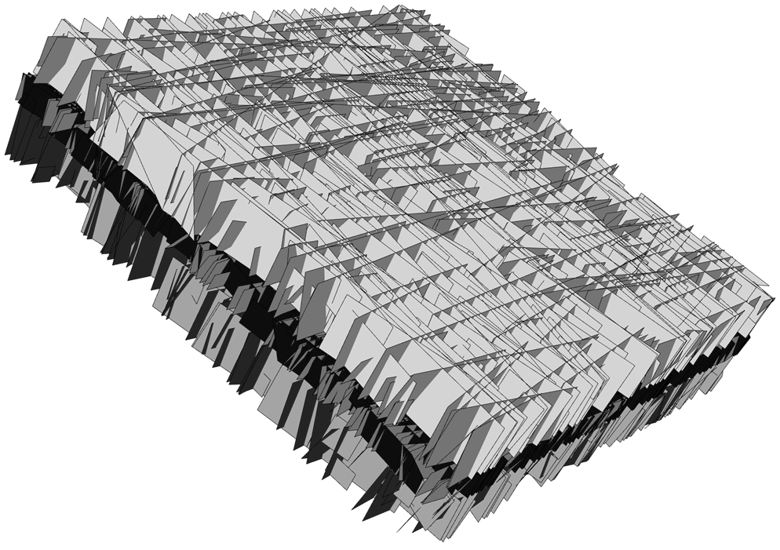
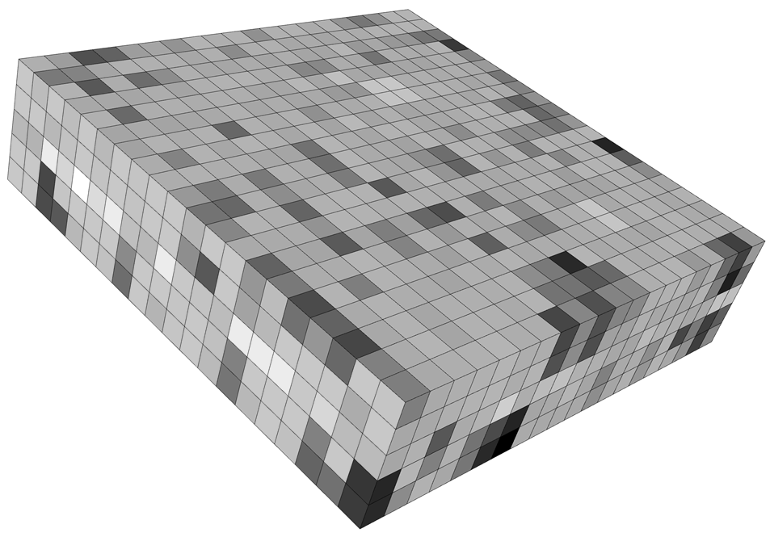

# Some advice from a fractured reservoir modeler to his younger self

### Steve Rogers, Golder, Vancouver, Canada

A wealthy gambler once tried to commission scientists to develop a system to predict the outcome of a horse race. A physicist assured him that he could deliver a 100% accuracy, with one caveat; “I’ll model the horse as a perfect sphere in a total vacuum”. All modelling is of course a form of reductionism although perhaps our physicist took it to an extreme. However, over the years as a fracture modeler, the question that I keep returning back to is, “do I need the “horse” or can I get away with the “sphere” to describe the fracture network such that my model can achieve what it needs to achieve?”

One of the problems with modelling flow through fracture systems, is in determining which structural elements are important for controlling the system. Logging of the wellbore can often detect a myriad of fractures, but which ones are important? In a moment of vanity earlier in my career, I coined Steve’s law of fractured reservoirs; “most fractures do little, some do a bit, a few do a lot”. That is basically a wordy way of saying that fracture KH (transmissivity) follows a log normal distribution and the distribution of KH is highly skewed. Therefore, the flow is typically channeled through a relatively small number of structures, often longer, with greater connectivity. So, from a flow perspective, maybe we don’t need to model everything. Combining the impact of the smaller less permeable fractures with the matrix properties is one way to try to computationally make the reservoir description more efficient and therefore, more “sphere like”.

But here’s the real problem; we can’t see longer more permeable fractures in the subsurface. If we’re lucky, we can see more permeable ones through production logs or drilling losses, but we will have limited sense of how that extends away from the wellbore. One of the ways to address challenges like this is through a methodology known as Discrete Fracture Network (DFN) modelling. The DFN approach seeks to explicitly model key structures in 3D, with their descriptions being defined in a statistical way through stochastic distributions of their key geometric and dynamic properties; typically, the orientation, intensity, size, shape, aperture and KH. Using geological knowledge, properties can be correlated together where necessary to ensure that geological sense is preserved such as longer structures being more permeable. These geologically realistic models provide an efficient way to describe these subsurface structures, honouring both data, structural geology and common sense.

It is possible to run dynamic modelling in the DFN based description, and often well scale and sector scale models may be run in these discrete digital descriptions of a fractured reservoir with fractures expressed as 2D plane elements and assigned flow attributes of KH, compressibility and aperture. In fact I would argue, at this scale of analysis, discrete models (“horse like”) allow a greater flexibility of analysis. However, for full field reservoir simulation, we need to upscale this discrete description into the more conventional continuum description (unless we’re happy to sit around for weeks or months while the model runs, soaking up all our computer resources!). In this format, fracture properties are converted to equivalent properties, typically for ever cell, expressing the fracture porosity, its directional permeability and also sigma factor (a measure of the matrix block size).

An important requirement in upscaling, is to ensure that structural connectivity (i.e. conductive structures extending over multiple grid cells) is preserved, rather than simply proximity (flow is simply grid cell to grid cell). That is the essential truth of fractured reservoirs in that it’s not just the properties but also the connectivity that needs to be preserved. Without that, the simulation model will struggle to reproduce key reservoir behaviours.

And so back to our optimistic physicist, predicting horse races. If we want a high level of predictability in our reservoir models, we can’t get away with the equivalent of a perfect sphere in total vacuum at all scales. At some point, if it doesn’t look like a horse, it isn’t a horse and its not going to give us a winner. 

### Figures

Example of a small scale DFN model and its upscaled directional permeability
