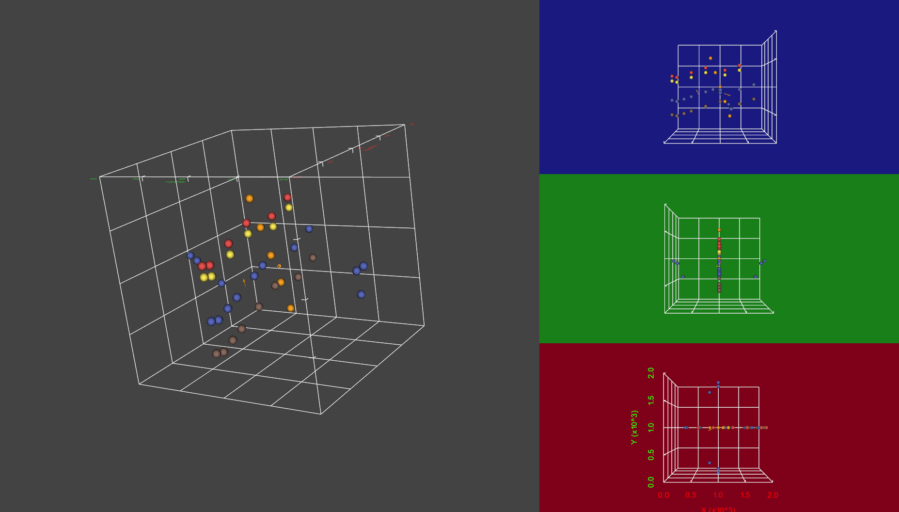
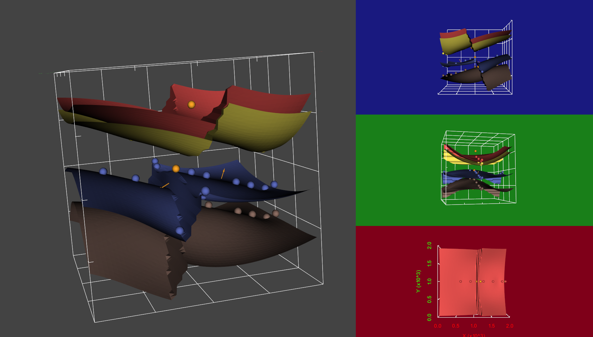

# GemPy: 3D Geological Modelling in Python

Making 3D geological models is hard. Classical explicit models
rely in the spatial vision of the modeller and their handcrafted
nature makes almost impossible to update them as more and more
information is gather. Novel implicit modelling based on global
 interpolations solve many of this problems but so far they are
 implemented in commercial softwares which provide limited
 functionality through their interfaces or APIs.

 Making a 3D geological models is hard, but making 50 different
 models for testing different hypothesis or 50000 models to get
 a complete description of the inherent uncertainty is much harder. And
 it was in this climate of frustration—as many other open-source
 projects—when GemPy was conceived.

 GemPy is a Python library based on the potential fields method developed
 by Laujaunie et al (1997) and expanded during the following years by
 many others [1].
 This method interpolates interfaces points between formations or facies
 and poles—i.e perpendicular vectors to the layer dip—to create a potential
 field from which the domains (layers) can be extracted [Fig 2]. Additionally,
 by  conditioning this potential field and combination many of them it is
 possible to model faults and unconformities.

#### Simple Example

Here, it is shown how with a few lines of code we can obtain a geological model. This
model is formed by 3 horizontal layers offset by an infinte fault:

```python
# Importing gempy
import gempy as gp

# Reading a gempy data object
geo_data = gp.read_pickle('BasicFault.pickle')
```
The main data (data coordinates and values) are stored in Pandas Dataframes

```python
gp.get_raw_data(geo_data, 'foliations').head()
```

<div>

<table border="1" class="dataframe">
  <thead>
    <tr style="text-align: right;">
      <th></th>
      <th>X</th>
      <th>Y</th>
      <th>Z</th>
      <th>azimuth</th>
      <th>dip</th>
      <th>polarity</th>
      <th>formation</th>
      <th>series</th>
      <th>order_series</th>
      <th>G_x</th>
      <th>G_y</th>
      <th>G_z</th>
      <th>isFault</th>
    </tr>
  </thead>
  <tbody>
    <tr>
      <th>0</th>
      <td>917.45</td>
      <td>1000.0</td>
      <td>-1135.398</td>
      <td>270.0</td>
      <td>71.565</td>
      <td>1</td>
      <td>MainFault</td>
      <td>fault</td>
      <td>1</td>
      <td>-0.948683</td>
      <td>-1.742702e-16</td>
      <td>0.316229</td>
      <td>True</td>
    </tr>
    <tr>
      <th>1</th>
      <td>1450.00</td>
      <td>1000.0</td>
      <td>-1150.000</td>
      <td>90.0</td>
      <td>18.435</td>
      <td>1</td>
      <td>Reservoir</td>
      <td>Rest</td>
      <td>2</td>
      <td>0.316229</td>
      <td>1.936342e-17</td>
      <td>0.948683</td>
      <td>False</td>
    </tr>
  </tbody>
</table>
</div>

We can visualize the 3D data using vtk with the following function.
```python
gp.visualize(geo_data)
```


Now we can categorize the data into different depositional series and faults.
```python
gp.set_data_series(geo_data, {"fault":geo_data.formations[4], 
                              "Rest":np.delete(geo_data.formations, 4)},
                    order_series = ["fault", "Rest"])
```
And we are ready to interpolate:
```python
interp_data = gp.InterpolatorInput(geo_data, u_grade=[3,3])
sol = gp.compute_model(interp_data)
gp.visualize(geo_data, pot_field=sol[1,:])
```




# 
As any other open-source project, GemPy
 did not start from scratch. Pandas for data management [2], the
 Visualization Toolkit (vtk) for 3D visualization and manipulation [3],
 skimage for computing topology and extract 3D surfaces [4] or the use
  of  pynoddy for simulating kinematics [5]; are only an
  example of how much can be accomplish integrating what the latest developments
   of the scientific community in the open-source scene.

 GemPy was born with 3D geological modelling as an inference problem
  in mind. This means that automatic differentiation to compute gradients
   and computational performance were key. To achieve this, GemPy is built
   on top of Theano [6]. Theano is a Python library that allows to define
   symbolically mathematical expressions to be optimized and differentiated.
   If this were not enough the code is compile  either in C or CUDA for the use of
   GPUs. The use of Theano opens up the integration with pymc3 [7] for a
   fully Bayesian framework in geological modelling.

 But this is only the beginning. Making geological modelling open-source
 is another step towards an ecosystem were geological modeling, geophysical
 inversions and process simulations coexist moving from deterministic
  unique models to an automatic stochastic system of validation of hypothesis.


## References 

[1] Lajaunie, C., Courrioux, G., & Manuel, L. (1997). Foliation fields and 3D cartography in geology: principles of a method based on potential interpolation. Mathematical Geology, 29(4), 571-584.
[2] McKinney, W. (2010, June). Data structures for statistical computing in python. In Proceedings of the 9th Python in Science Conference (Vol. 445, pp. 51-56). Austin, TX: SciPy.
[3] Schroeder, W. J., Lorensen, B., & Martin, K. (2004). The visualization toolkit: an object-oriented approach to 3D graphics. Kitware.
[4] Boulogne, F., Warner, J. D., & Neil Yager, E. (2014). scikit-image: Image processing in Python.
[5] Wellmann, J. F., Thiele, S. T., Lindsay, M. D., & Jessell, M. W. (2015). pynoddy 1.0: an experimental platform for automated 3-D kinematic and potential field modelling. Geosci. Model Dev. Discuss, 8, 10011-10051.
[6] Al-Rfou, R., Alain, G., Almahairi, A., Angermueller, C., Bahdanau, D., Ballas, N., ... & Bengio, Y. (2016). Theano: A Python framework for fast computation of mathematical expressions. arXiv preprint.
[7] Salvatier, J., Wiecki, T. V., & Fonnesbeck, C. (2016). Probabilistic programming in Python using PyMC3. PeerJ Computer Science, 2, e55.