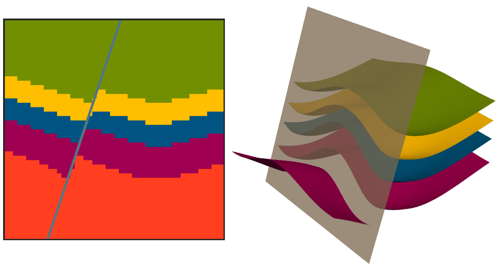
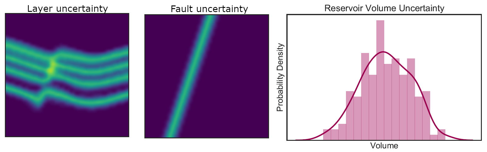

# GemPy: 3D Structural Geomodeling in Python

Making 3D geological models is hard. Classical explicit models rely on the
expertise of the modeller and their manufactured nature makes them extremely
tedious to update as more information is obtained. Implicit modelling based on
global interpolations can solve many of these problems, but so far they have
been implemented in commercial software only, making them often prohibitivly
expensive for scientists. Also, proprietary geomodeling software tends to only
provide limited functionality through their interfaces or APIs, limiting modern
reproducible geocomputing workflows.

Making a 3D geomodel is hard, but making 50 different models for testing
different hypotheses or 50000 models to get a complete description of the
inherent model uncertainty is much harder. And it was in this climate of
frustration and limitation—as is the case with many other open-source
projects—when `GemPy` was conceived.

`GemPy` is an open-source Python library based on the potential field method
developed by Laujaunie et al (1997) [1] and expanded during the following years
by many others. The method interpolates interface points and surface poles—i.e
perpendicular vectors to the surface dip—to create a potential field from which
the domains (e.g. layers) can be extracted [Fig 2]. And by conditioning this
potential field and combining multiple of them, it is possible to model faults
and unconformities.

## Example

To create a `GemPy` model, we have to define its extent, the grid resolution to
be used for discretization, as well as the input surface points and
orientations, as well as the geological relations of the data.

```python
import gempy as gp
geomodel = gp.create_model("Geomodel Name")
gp.init_data(geomodel, extent, resolution, surfacepoints, orientations)
geological_information = {
    "Fault Series": 'Main Fault', 
    "Stratigraphy Series": ('Sandstone 2', 'Siltstone', 'Shale', 'Sandstone 1')
}
gp.map_stack_to_surfaces(geomodel, geological_information)
gp.set_interpolator(geomodel)
```

Then, we can compute the geomodel using

```python
gp.compute_model(geomodel)
```

and visualize the geomodel using `GemPy`'s 2D and 3D visualization functionality:

```python
gp.plot.plot_2d(geomodel)
gp.plot.plot_3d(geomodel)
```



As most other open-source projects, `GemPy` rests on the shoulders of powerful
open-source libraries: `pandas` [2] for data management, `pyvista` [3] for 3-D
visualization and `scikit-image` [4] for extracting 3D surfaces from the
interpolated potential fields, to just name a few. Thus `GemPy` is annother
example of how much can be accomplished by integrating the latest developments
of the scientific community in the open-source software scene.

One of the main motivations for the development of `GemPy` was to enable the
seamless interoperability with other open-source software to enable uncertainty
quantification of geomodels. Every object of `GemPy` is accessible and easy to
modify, thus making stochastic simulations of any aspect of a geomodel
straight-forward.

```python
stochasticmodel = StochasticModel(geomodel)

for i in range(1000):
    sample_data = stochasticmodel.sample()
    stochasticmodel.modify(*sample_data)
    gp.compute_model(geomodel)
```



For stochastic simulations, computational performance is key. For this, `GemPy`
was built using `theano` [6], and will soon be ported to `tensorflow`. Both
libraries allow us to compute the geomodels on the GPU, significantly decreasing
computational time. Our initial research purpose for `GemPy` was to learn
uncertain geological models on additional information (e.g. gravity data,
knowledge of the regional geology) using probabilistic machine learning
(Bayesian networks). This is greatly helped by its seamless integration into
`pymc3` [7], a probabilistic programming framework, allowing us to use
gradient-based sampling methods to explore the Bayesian posterior model space
efficiently.

But this is only the beginning. Making geological modelling open-source is
another step towards an ecosystem were geological modelling, geophysical
inversions and process simulations coexist, moving from deterministic unique
models to an automatic stochastic system of validation of hypothesis - and where
the reproducibility of structural geomodeling is not locked behind prohibitive
paywalls.

## References 

[1] Lajaunie, C., Courrioux, G., & Manuel, L. (1997). Foliation fields and 3D
cartography in geology: principles of a method based on potential interpolation.
Mathematical Geology, 29(4), 571-584.

[2] McKinney, W. (2010, June). Data structures for statistical computing in
python. In Proceedings of the 9th Python in Science Conference (Vol. 445, pp.
51-56). Austin, TX: SciPy.

[3] Sullivan et al., (2019). PyVista: 3D plotting and mesh analysis through a
streamlined interface for the Visualization Toolkit (VTK). Journal of Open
Source Software, 4(37), 1450.

[4] Boulogne, F., Warner, J. D., & Neil Yager, E. (2014). scikit-image: Image
processing in Python.

[6] Al-Rfou, R., Alain, G., Almahairi, A., Angermueller, C., Bahdanau, D.,
Ballas, N., ... & Bengio, Y. (2016). Theano: A Python framework for fast
computation of mathematical expressions. arXiv preprint.

[7] Salvatier, J., Wiecki, T. V., & Fonnesbeck, C. (2016). Probabilistic
programming in Python using PyMC3. PeerJ Computer Science, 2, e55.

